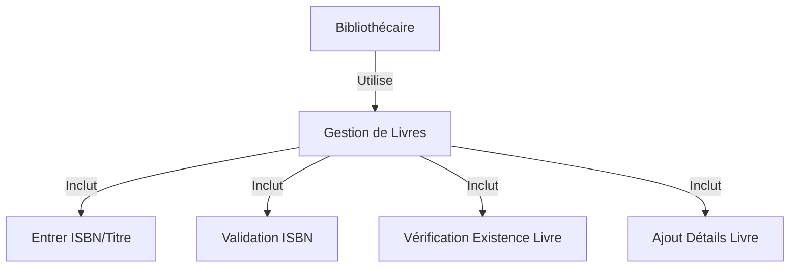
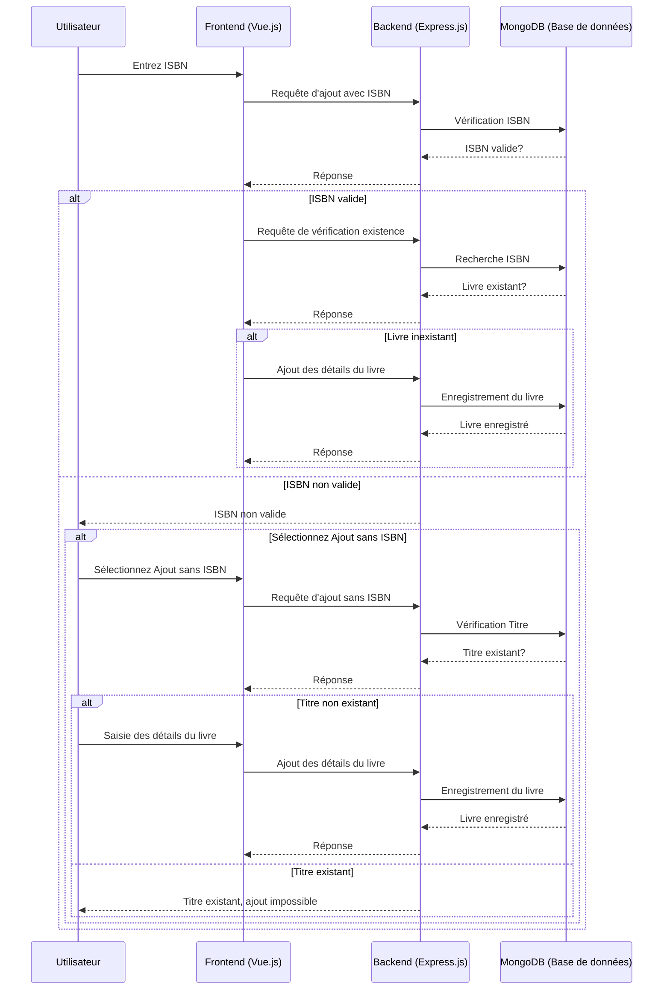

# Proposition d'Amélioration du Système de Gestion de Livres

## Contexte
Actuellement, le système de gestion de livres permet aux utilisateurs de rechercher des livres, mais ne permet pas aux bibliothécaires d'ajouter des livres au système de manière efficace. La demande principale est de faciliter l'ajout de livres par les bibliothécaires, en prenant en compte les particularités liées aux livres usagés et à l'absence d'ISBN pour les livres publiés avant 1972.

## Solution Proposée

### Modification du Processus d'Ajout de Livres

#### 1. Ajout d'un Livre avec ISBN

- **Étape 1**: L'utilisateur entre l'ISBN du livre.
- **Étape 2**: Le système vérifie la validité de l'ISBN.
- **Étape 3**: Le système vérifie si l'ISBN existe déjà dans la base de données.
  - Si l'ISBN existe, le système refuse l'ajout.
  - Si l'ISBN n'existe pas, l'utilisateur peut passer à l'ajout des détails du livre.

#### 2. Ajout d'un Livre sans ISBN (pour les livres publiés avant 1972)

- **Étape 1**: L'utilisateur sélectionne l'option d'ajout sans ISBN.
- **Étape 2**: L'utilisateur entre le titre du livre (qui servira d'identifiant unique).
- **Étape 3**: Le système vérifie si le titre existe déjà dans la base de données.
  - Si le titre existe, le système refuse l'ajout.
  - Si le titre n'existe pas, l'utilisateur peut ajouter les détails du livre.

### Diagramme de Cas d'Utilisation

###  Diagramme de Séquence (Ajout de Livre)

